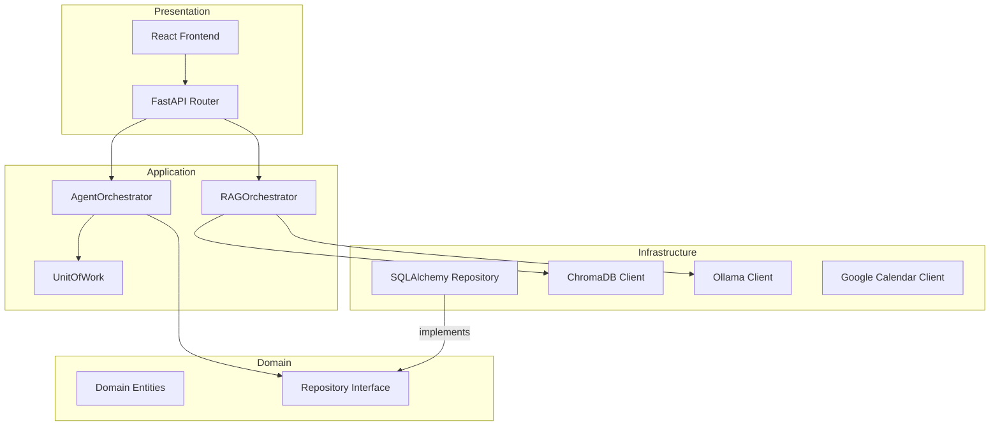
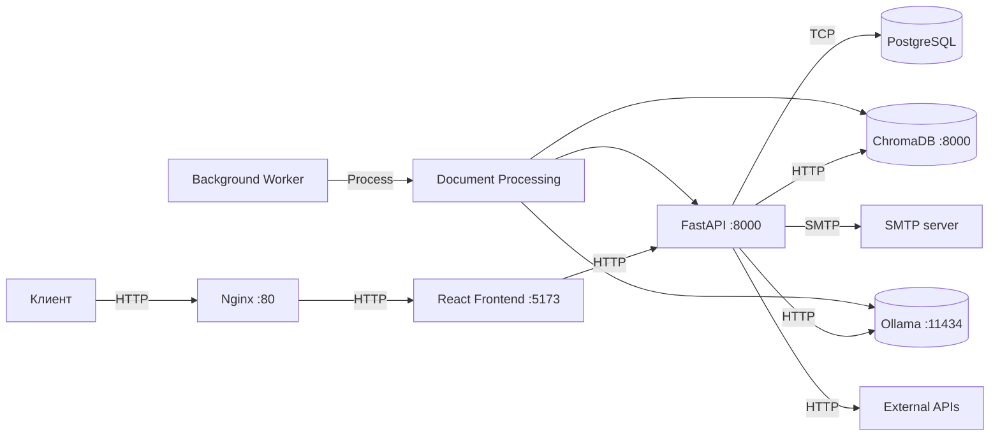
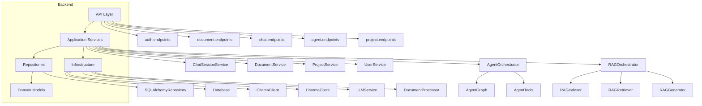
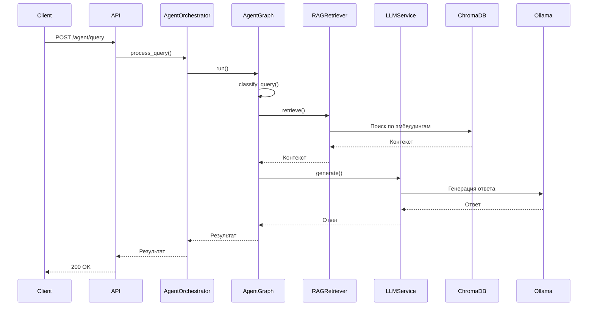
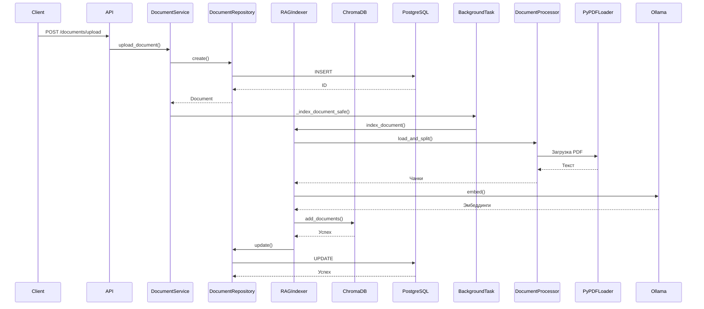
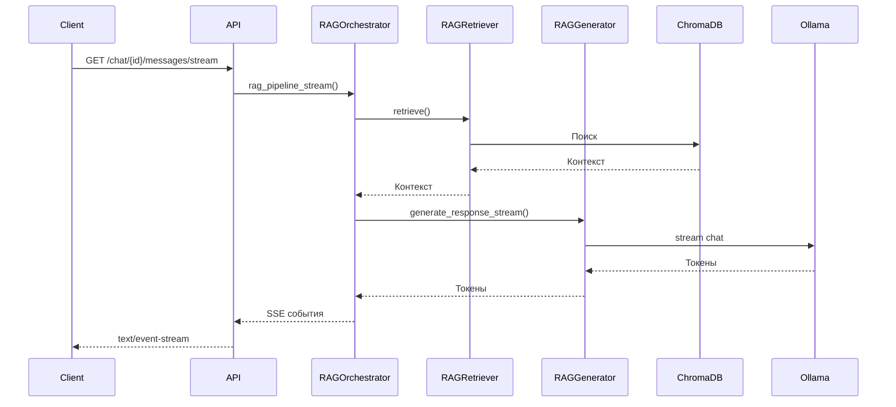
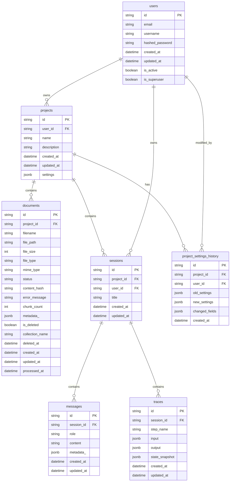

# DocuWeave

#### Краткое описание
DocuWeave — это современное веб-приложение для работы с документами, использующее RAG (Retrieval-Augmented Generation) и интеллектуальных агентов на основе LangGraph. Позволяет пользователям загружать, анализировать и взаимодействовать с документами через естественный язык. Проект предоставляет интерактивный чат-интерфейс, систему векторного поиска на базе ChromaDB и интеграцию с локальными LLM-моделями через Ollama. Архитектура включает модульную RAG-систему, агентную систему с инструментами и полный API-интерфейс для управления проектами, документами и чат-сессиями.

#### Глоссарий

| Название | Описание |
|--------|---------|
| Документ | Файл, загруженный пользователем для анализа (PDF, DOCX, TXT и др.). Содержит текст, метаданные и статус обработки. |
| Проект | Контейнер для документов, чатов и настроек. Пользователь может создавать несколько проектов для организации работы. |
| Чат-сессия | Диалог между пользователем и AI-агентом. Содержит историю сообщений и связана с проектом. |
| Агент | Интеллектуальный помощник, способный анализировать документы, отвечать на вопросы и выполнять задачи с помощью инструментов. |
| RAG (Retrieval-Augmented Generation) | Технология, сочетающая семантический поиск по документам с генерацией ответов на основе найденного контекста. |
| Инструмент агента | Функция, которую может использовать агент для выполнения специфических задач (поиск, суммаризация, анализ и т.д.). |
| Векторный поиск | Поиск документов по смыслу, а не по ключевым словам, с использованием эмбеддингов и векторной базы данных. |
| Эмбеддинг | Векторное представление текста, позволяющее сравнивать и искать схожие по смыслу фрагменты. |
| Чанкирование | Процесс разбиения документа на небольшие фрагменты (чанки) для более эффективного поиска и анализа. |
| Проектные настройки | Конфигурация, определяющая поведение RAG-системы и агента в рамках проекта (модели, температура, размер чанков и т.д.). |


### 2. Зависимости и технологический стек

#### Используемые языки программирования
- Python (3.12+)
- TypeScript

#### Используемые библиотеки и фреймворки

**Веб-фреймворки**
- FastAPI (0.136.0) — современный фреймворк для создания API на Python
- React (19.2.5) — библиотека для построения пользовательских интерфейсов

**ORM и базы данных**
- SQLAlchemy (2.0.49) — ORM для работы с PostgreSQL
- asyncpg (0.31.0) — асинхронный драйвер PostgreSQL
- ChromaDB (1.5.8) — векторная база данных для хранения эмбеддингов

**Машинное обучение и LLM**
- LangChain (1.2.15) — фреймворк для построения приложений с LLM
- LangGraph (1.1.9) — фреймворк для создания графов агентов
- Ollama (0.6.1) — клиент для взаимодействия с локальными LLM-моделями
- langchain-text-splitters (1.1.2) — инструменты для разбиения текста на чанки

**Валидация и сериализация**
- Pydantic (2.13.3) — валидация данных и сериализация
- Pydantic[email] — расширение Pydantic с поддержкой email-валидации

**Обработка документов**
- pypdf (6.10.2) — извлечение текста из PDF
- docx2txt (0.9) — извлечение текста из DOCX
- unstructured (0.22.26) — универсальный парсер документов

**Аутентификация**
- python-jose (3.5.0) — работа с JWT-токенами
- bcrypt — хеширование паролей

**Утилиты и вспомогательные библиотеки**
- alembic (1.18.4) — миграции базы данных
- python-multipart (0.0.27) — обработка multipart-форм (загрузка файлов)
- httpx (0.28.1) — асинхронный HTTP-клиент
- uv (современный менеджер пакетов Python)

**Фронтенд-библиотеки**
- Tailwind CSS — utility-first CSS-фреймворк
- Vite — сборщик и сервер разработки
- React Router DOM — маршрутизация
- React Query — управление серверным состоянием
- Zustand — управление клиентским состоянием
- Axios — HTTP-клиент
- Lucide React — иконки
- Framer Motion — анимации
- React Hot Toast — уведомления

#### Используемые прочие технологии
- **Базы данных**: PostgreSQL (15-alpine) — реляционная база данных для хранения метаданных
- **Векторные базы данных**: ChromaDB — для хранения и поиска эмбеддингов документов
- **LLM-сервисы**: Ollama — для запуска и управления локальными LLM-моделями (qwen2.5:7b, nomic-embed-text)
- **Контейнеризация**: Docker и Docker Compose — для оркестрации сервисов
- **Системы сборки**: Vite (фронтенд), uv (бэкенд)
- **CI/CD**: Не указано в проекте
- **Внешние API**: Ollama API (локальный), ChromaDB API (локальный)
- **Средства мониторинга**: Логирование через Python logging, health checks в Docker Compose
- **Системы кэширования**: Не используется явно, но ChromaDB кэширует эмбеддинги
- **Очереди сообщений**: Не используется
- **CDN**: Не используется


### 3. Архитектура

#### Физическая структура директорий
```
/tmp/tmp80cxrx7m/DocuWeave-master
├── backend
│   ├── alembic                 # Миграции базы данных
│   ├── scripts                 # Скрипты инициализации
│   ├── src
│   │   ├── api                 # Эндпоинты API
│   │   ├── infrastructure      # Инфраструктурный слой (модели, БД, конфигурация)
│   │   ├── prompts             # Промпты для LLM
│   │   ├── services            # Бизнес-логика (сервисы, репозитории)
│   │   └── lifespan.py         # Жизненный цикл приложения
│   ├── Dockerfile              # Docker-образ бэкенда
│   └── pyproject.toml          # Зависимости и конфигурация
├── frontend
│   ├── public                  # Публичные статические файлы
│   ├── src
│   │   ├── components          # UI-компоненты
│   │   ├── hooks               # Кастомные React-хуки
│   │   ├── layouts             # Макеты страниц
│   │   ├── pages               # Страницы приложения
│   │   ├── services            # Сервисы API
│   │   ├── types               # TypeScript-типы
│   │   └── App.tsx             # Точка входа
│   ├── Dockerfile              # Docker-образ фронтенда
│   └── package.json            # Зависимости фронтенда
├── docker-compose.yml          # Оркестрация сервисов
└── .env.example                # Шаблон переменных окружения
```

#### Логическая архитектура
Архитектура проекта представляет собой **модульный монолит** с элементами **чистой архитектуры** и **event-driven** подхода. Основные слои:
- **Presentation**: FastAPI роутеры и React-компоненты
- **Application**: Сервисы, orchestrators, графы агентов
- **Domain**: Сущности (User, Project, Document), бизнес-правила
- **Infrastructure**: Репозитории, базы данных, внешние API

Используются следующие паттерны:
- **Repository Pattern** — абстракция доступа к данным
- **Dependency Injection** — внедрение зависимостей через FastAPI Depends
- **Factory Pattern** — создание компонентов RAG-системы
- **State Pattern** — управление состоянием агента через LangGraph
- **Strategy Pattern** — выбор инструментов агента



#### Диаграмма верхнеуровневой архитектуры


#### Диаграмма внутренних компонентов


#### Диаграммы последовательности

**Обработка запроса к агенту**


**Загрузка документа**


**Потоковый чат**


#### Схема базы данных



### 4. Основные обработчики в системе

#### CLI-утилиты (консольные команды)
| Команда | Назначение |
|--------|---------|
| `uvicorn src.main:app --host 0.0.0.0 --port 8000 --reload` | Запуск FastAPI-сервера в режиме разработки с авто-перезагрузкой |
| `alembic upgrade head` | Применение всех миграций базы данных |
| `alembic revision --autogenerate -m "описание"` | Создание новой миграции на основе изменений в моделях |
| `docker-compose up -d` | Запуск всех сервисов проекта в фоновом режиме |
| `./scripts/make-migration.sh "описание"` | Создание миграции Alembic через Docker |
| `docker-compose run --rm migrations alembic downgrade -1` | Откат последней миграции базы данных |

#### API-эндпоинты (HTTP)
| Метод и полный путь | Назначение | Схемы |
|--------|---------|---------|
| POST /auth/register | Регистрация нового пользователя | UserRegister, TokenWithUser |
| POST /auth/login | Аутентификация и получение JWT токена | UserLogin, TokenWithUser |
| GET /auth/me | Получение информации о текущем пользователе | UserResponse |
| POST /projects | Создание нового проекта | ProjectCreate, ProjectResponse |
| GET /projects | Получение списка проектов пользователя | ProjectResponse[] |
| PATCH /projects/{project_id} | Обновление проекта | ProjectUpdate, ProjectResponse |
| DELETE /projects/{project_id} | Удаление проекта | - |
| GET /projects/{project_id}/settings | Получение настроек проекта | ProjectSettings |
| PATCH /projects/{project_id}/settings | Обновление настроек проекта | ProjectSettingsUpdate, ProjectSettings |
| GET /projects/{project_id}/settings/history | Получение истории изменений настроек | HistoryPagination |
| POST /projects/{project_id}/documents/upload | Загрузка документа в проект | DocumentUploadResponse |
| GET /projects/{project_id}/documents | Получение списка документов проекта | DocumentListResponse[] |
| GET /projects/{project_id}/documents/{document_id} | Получение метаданных документа | DocumentResponse |
| DELETE /projects/{project_id}/documents/{document_id} | Удаление документа | - |
| POST /projects/{project_id}/chat-sessions | Создание новой чат-сессии | ChatSessionCreate, ChatSessionResponse |
| GET /projects/{project_id}/chat-sessions | Получение списка чат-сессий | ChatSessionResponse[] |
| GET /projects/{project_id}/chat-sessions/{chat_id} | Получение информации о чат-сессии | ChatSessionResponse |
| PATCH /projects/{project_id}/chat-sessions/{chat_id} | Обновление чат-сессии | ChatSessionUpdate, ChatSessionResponse |
| DELETE /projects/{project_id}/chat-sessions/{chat_id} | Удаление чат-сессии | - |
| POST /projects/{project_id}/chat-sessions/{chat_id}/messages | Отправка сообщения в чат | MessageCreate, MessageResponse |
| GET /projects/{project_id}/chat-sessions/{chat_id}/messages | Получение истории сообщений | MessageResponse[] |
| GET /projects/{project_id}/chat-sessions/{chat_id}/messages/stream | Потоковое получение ответа от агента | - |
| POST /agent/query | Обработка запроса через интеллектуального агента | AgentQueryRequest, AgentResponse |
| POST /agent/query/rag-fallback | Обработка с fallback на RAG | AgentQueryRequest, AgentResponse |
| POST /agent/analyze-document | Анализ документа инструментами агента | DocumentAnalysisRequest, DocumentAnalysisResponse |
| POST /agent/batch-process | Пакетная обработка запросов | BatchQueryRequest, BatchQueryResponse |
| GET /agent/info | Получение информации о конфигурации агента | AgentInfoResponse |
| GET /agent/health | Проверка здоровья агента | - |

#### Слушатели событий из очередей / брокеров сообщений
Проект не использует брокеры сообщений (Kafka, RabbitMQ, Redis Streams и т.д.). Вместо этого используется механизм фоновых задач через `BackgroundTasks` в FastAPI для асинхронной обработки документов.

#### Отложенные и фоновые задачи (с cron, Celery, ARQ, RQ, APScheduler, Hangfire, и т.д.)
| Имя задачи | Назначение | Тип |
|--------|---------|---------|
| _index_document_safe | Асинхронная индексация загруженного документа в векторную базу данных | Фоновая задача (BackgroundTask) |
| retry_indexing | Повторная попытка индексации документа, завершившегося с ошибкой | Фоновая задача (BackgroundTask) |
| delete_document | Асинхронное удаление документа из системы (файл, индекс, БД) | Фоновая задача (BackgroundTask) |
| batch_process_queries | Пакетная обработка нескольких запросов к агенту | Периодическая (вызывается по запросу) |


### 5. Конфигурация
Проект использует систему конфигурации на основе переменных окружения и Pydantic Settings. Основные аспекты:

**Источники конфигурации:**
- Файл `.env` в корне проекта (указывается в docker-compose.yml)
- Переменные окружения системы
- Значения по умолчанию в коде

**Основные переменные окружения:**
- `POSTGRES_DB`, `POSTGRES_USER`, `POSTGRES_PASSWORD` — параметры подключения к PostgreSQL
- `DATABASE_URL` — полный URL для подключения к БД (формируется из предыдущих)
- `OLLAMA_HOST` — адрес сервера Ollama (по умолчанию http://ollama:11434)
- `OLLAMA_EMBEDDING_MODEL` — модель для генерации эмбеддингов (по умолчанию nomic-embed-text)
- `OLLAMA_LLM_MODEL` — модель для генерации текста (по умолчанию qwen2.5:7b)
- `CHROMA_HOST`, `CHROMA_PORT` — параметры подключения к ChromaDB
- `JWT_SECRET_KEY` — секретный ключ для подписи JWT-токенов
- `JWT_ALGORITHM` — алгоритм шифрования JWT (по умолчанию HS256)
- `ACCESS_TOKEN_EXPIRE_MINUTES` — время жизни access-токена в минутах
- `LOG_LEVEL` — уровень логирования (по умолчанию INFO)

**Механизм загрузки:**
Конфигурация загружается через `pydantic-settings` в `src/infrastructure/core/config.py`. Используется декоратор `@lru_cache` для кэширования настроек. Файл `.env` ищется в корне проекта.

**Валидация:**
Все переменные проходят валидацию через Pydantic. Например, проверяется наличие `DATABASE_URL`, корректность формата email при регистрации. При ошибках валидации выбрасываются исключения.

**Поддержка окружений:**
Проект поддерживает разные окружения через переменную `ENVIRONMENT` (development, staging, production). В production-режиме ChromaDB использует локальное хранилище, в development — подключение по HTTP.

**Расположение:**
- Основные настройки: `backend/src/infrastructure/core/config.py`
- Шаблон переменных: `.env.example`
- Конфигурация логирования: `backend/src/infrastructure/core/logging_settings.py`


### 6. Мониторинг
Проект реализует базовую систему мониторинга, включающую логирование, метрики и трейсинг.

**Логирование:**
- Используется стандартная библиотека `logging` Python
- Настройки в `backend/src/infrastructure/core/logging_settings.py`
- Поддержка нескольких уровней: DEBUG, INFO, WARNING, ERROR
- Формат: `%(asctime)s | %(name)s | %(levelname)-8s | %(message)s`
- Вывод: в stdout (для Docker) и в файл (опционально)
- Фильтрация: скрытие verbose-логов от SQLAlchemy, asyncpg, httpx
- Используется в сервисах для отслеживания операций (загрузка документа, обработка запроса и т.д.)

**Метрики:**
- Встроенные метрики в бизнес-логике:
  - Время обработки запроса агентом (`processing_time`)
  - Количество шагов обработки (`steps`)
  - Количество обработанных документов (`chunk_count`)
  - Статус зависимостей (Ollama, ChromaDB, PostgreSQL)
- Метрики доступны через health check эндпоинты
- Не используется специализированный сборщик метрик (Prometheus, StatsD)

**Распределённый трейсинг:**
- Трейсинг операций агента реализован через сущность `GraphTrace`
- Каждый вызов агента записывается в БД с:
  - Входными параметрами
  - Выполненными шагами
  - Использованными инструментами
  - Финальным ответом
  - Временными метками
- Используется для отладки и анализа работы агента
- Не используется специализированный трейсинг (Jaeger, OpenTelemetry)


### 7. Тестирование
Тесты отсутствуют в предоставленной структуре проекта. В README.md упоминается команда `pytest tests/`, но директория `tests` не включена в дерево проекта. Аналогично, в `frontend` упоминается `npm test`, но соответствующие файлы тестов не представлены.

**Предполагаемая структура тестов (на основе README):**
- Backend: `pytest` с покрытием через `pytest-cov`
- Frontend: `vitest` с `@testing-library/react`

**Запуск тестов:**
- Backend: `cd backend && pytest tests/`
- Frontend: `cd frontend && npm test`

**Фикстуры:**
Не обнаружены в коде. Предположительно, должны быть реализованы на уровне pytest для создания тестовых данных.

**Покрытие:**
Не указано. В README упоминается `pytest --cov=src tests/`, что предполагает использование `pytest-cov` для измерения покрытия.

**Запуск:**
Тесты должны запускаться через:
- `pytest` (backend)
- `npm test` (frontend)
- Через Docker Compose: `docker-compose run --rm backend pytest`
