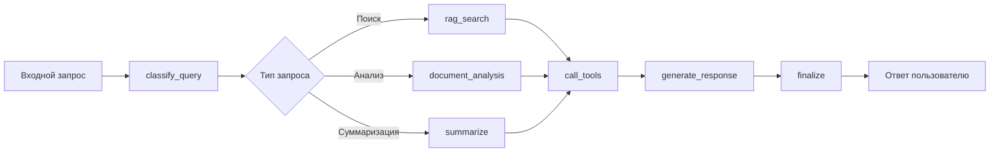

# DocuWeave


**DocuWeave** — это современное веб-приложение для работы с документами, использующее RAG (Retrieval-Augmented Generation) и интеллектуальных агентов на основе LangGraph. Позволяет загружать, анализировать и взаимодействовать с документами через естественный язык.

## ✨ Ключевые возможности

- **📄 Умная обработка документов**: Поддержка PDF, DOCX, TXT с автоматическим извлечением текста и чанкированием
- **🤖 Интеллектуальный агент**: Агент на LangGraph с инструментами для анализа, суммаризации и ответов на вопросы
- **🔍 Векторный поиск**: Интеграция с ChromaDB для семантического поиска по документам
- **💬 Интерактивный чат**: Чат-интерфейс с потоковыми ответами и историей диалогов
- **🚀 Готовое развертывание**: Полная Docker Compose конфигурация для быстрого запуска
- **🔐 Безопасность**: JWT аутентификация, ролевая модель, защита данных

## 🏗️ Архитектура

### Высокоуровневая схема
```
┌─────────────────┐    ┌─────────────────┐    ┌─────────────────┐
│   Frontend      │    │    Backend      │    │   Базы данных   │
│   (React)       │◄──►│   (FastAPI)     │◄──►│   PostgreSQL    │
│   TypeScript    │    │   Python        │    │   ChromaDB      │
└─────────────────┘    └─────────────────┘    └─────────────────┘
         │                       │                       │
         │                       │                       │
         ▼                       ▼                       ▼
┌─────────────────┐    ┌─────────────────┐    ┌─────────────────┐
│   Пользователь  │    │   AI Сервисы    │    │   Хранилище     │
│   Интерфейс     │    │   Ollama        │    │   Документов    │
└─────────────────┘    │   LangChain     │    └─────────────────┘
                       │   LangGraph     │
                       └─────────────────┘
```

### Модули системы
1. **RAG система**: Модульная архитектура с разделением на Indexer, Retriever, Generator, Orchestrator
2. **Агентная система**: Интеллектуальный агент на LangGraph с инструментами для анализа документов
3. **API слой**: RESTful API с эндпоинтами для документов, чатов, проектов и агента
4. **Инфраструктура**: Docker, PostgreSQL, ChromaDB, Ollama

### Ключевые компоненты
- **UnifiedOllamaClient**: Единый клиент для работы с моделями Ollama
- **AgentOrchestrator**: Координатор работы агента с интеграцией RAG
- **RAGOrchestrator**: Управление полным RAG пайплайном
- **DocumentProcessor**: Обработка и чанкирование документов

## 🚀 Быстрый старт

### Предварительные требования
- Docker и Docker Compose
- 16+ GB RAM (рекомендуется для работы моделей Ollama)
- Git

### Установка и запуск за 5 минут

```bash
# 1. Клонирование репозитория
git clone <repository-url>
cd DocuWeave

# 2. Настройка переменных окружения
cp .env.example .env
# Отредактируйте .env при необходимости

# 3. Запуск всех сервисов
docker-compose up -d

# 4. Проверка работоспособности
docker-compose ps
```

### Проверка работоспособности
После запуска откройте в браузере:

- **📚 Backend API документация**: http://localhost:8000/docs (Swagger UI)
- **🎨 Frontend приложение**: http://localhost:5173
- **🔍 ChromaDB UI**: http://localhost:8001
- **🤖 Ollama API**: http://localhost:11434

### Инициализация базы данных
```bash
# Миграции выполняются автоматически при первом запуске
# Для ручного запуска:
docker-compose run migrations
```

## 📚 Подробная документация

- **[Backend документация](./backend/README.md)** - Подробное описание API, архитектуры и разработки бэкенда
- **[Frontend документация](./frontend/README.md)** - Руководство по фронтенду, компонентам и UI
- **[Docker Compose](./docker-compose.yml)** - Конфигурация всех сервисов
- **[Переменные окружения](./.env.example)** - Шаблон для настройки окружения

## 🐳 Сервисы Docker Compose

| Сервис | Порт | Назначение | Особенности |
|--------|------|------------|-------------|
| **backend** | 8000 | FastAPI приложение | Автоматическая перезагрузка, health checks |
| **frontend** | 5173 | React приложение | Hot reload, оптимизированная сборка |
| **db** | 5432 | PostgreSQL | Персистентное хранилище, health checks |
| **chromadb** | 8001 | ChromaDB | Векторная база для эмбеддингов |
| **ollama** | 11434 | Ollama LLM | Локальные LLM модели |
| **migrations** | - | Alembic миграции | Автоматическое применение миграций |

## 📡 API Эндпоинты

### Агент
- `POST /agent/query` - Обработка запроса через интеллектуального агента
- `POST /agent/query/rag-fallback` - Обработка с fallback на RAG
- `POST /agent/analyze-document` - Анализ документа инструментами агента
- `POST /agent/batch-process` - Пакетная обработка запросов
- `GET /agent/info` - Информация о конфигурации агента
- `GET /agent/health` - Проверка здоровья агента

### Документы
- `POST /documents/upload` - Загрузка документа (PDF, DOCX, TXT)
- `DELETE /documents/{document_id}` - Удаление документа
- `GET /documents` - Список документов проекта
- `GET /documents/{document_id}` - Получение метаданных документа

### Чат
- `POST /chat/sessions` - Создание сессии чата
- `GET /chat/sessions` - Список сессий пользователя
- `POST /chat/{chat_id}/messages` - Отправка сообщения
- `GET /chat/{chat_id}/messages/stream` - Потоковое получение ответа
- `GET /chat/{chat_id}/messages` - История сообщений

### Проекты
- `GET /projects` - Список проектов пользователя
- `POST /projects` - Создание проекта
- `PATCH /projects/{project_id}` - Обновление настроек проекта
- `DELETE /projects/{project_id}` - Удаление проекта

### Аутентификация
- `POST /auth/register` - Регистрация пользователя
- `POST /auth/login` - Вход и получение JWT токена
- `POST /auth/refresh` - Обновление токена
- `GET /auth/me` - Информация о текущем пользователе

## 🤖 Агентная система

### Архитектура агента
Агент построен на **LangGraph** и состоит из следующих узлов:



### Инструменты агента
1. **rag_search** - Поиск релевантных документов в векторной базе
2. **document_analysis** - Анализ документа (суммаризация, ключевые точки и т.д.)
3. **summarize** - Суммаризация текста
4. **extract_entities** - Извлечение сущностей из текста
5. **answer_with_context** - Ответ на вопрос на основе контекста
6. **classify_query** - Классификация запроса пользователя

### Пример использования агента
```python
# Пример запроса к агенту через API
import requests

response = requests.post(
    "http://localhost:8000/agent/query",
    json={
        "query": "Какие основные выводы из отчета по продажам?",
        "project_id": "project_123",
        "stream": False
    },
    headers={"Authorization": "Bearer <token>"}
)

print(response.json())
```

## 🔧 Конфигурация

### Переменные окружения (.env)
```bash
# База данных
POSTGRES_DB=Mydatabase123
POSTGRES_HOST=db
POSTGRES_PASSWORD=Mypass123
POSTGRES_USER=Myuser123

# Ollama
OLLAMA_HOST=http://ollama:11434
OLLAMA_EMBEDDING_MODEL=nomic-embed-text
OLLAMA_LLM_MODEL=qwen2.5:7b

# ChromaDB
CHROMA_HOST=chromadb
CHROMA_PORT=8000

# Агент
AGENT_ENABLED=true
AGENT_MAX_STEPS=10

# JWT
JWT_SECRET_KEY=your-secret-key-change-in-production
JWT_ALGORITHM=HS256
ACCESS_TOKEN_EXPIRE_MINUTES=30

# Логирование
LOG_LEVEL=INFO
```

### Настройка моделей Ollama
По умолчанию используются:
- **Модель эмбеддингов**: `nomic-embed-text` (1536 размерность)
- **LLM модель**: `qwen2.5:7b` (7 миллиардов параметров)

Для изменения моделей:
1. Отредактируйте `OLLAMA_EMBEDDING_MODEL` и `OLLAMA_LLM_MODEL` в `.env`
2. Перезапустите сервис Ollama: `docker-compose restart ollama`
3. Убедитесь, что модель загружена: `docker-compose exec ollama ollama pull <model-name>`

## 🧪 Примеры использования

### Загрузка документа
```bash
curl -X POST "http://localhost:8000/documents/upload" \
  -H "Authorization: Bearer <token>" \
  -F "file=@/path/to/document.pdf" \
  -F "project_id=project_123"
```

### Взаимодействие с агентом
```bash
curl -X POST "http://localhost:8000/agent/query" \
  -H "Authorization: Bearer <token>" \
  -H "Content-Type: application/json" \
  -d '{
    "query": "Обобщите основные идеи из загруженных документов",
    "project_id": "project_123"
  }'
```

### Создание чат-сессии
```bash
curl -X POST "http://localhost:8000/chat/sessions" \
  -H "Authorization: Bearer <token>" \
  -H "Content-Type: application/json" \
  -d '{
    "project_id": "project_123",
    "title": "Обсуждение отчетов"
  }'
```

## 🛠️ Разработка

### Локальная разработка backend
```bash
cd backend
uv sync  # Установка зависимостей
cp .env.example .env  # Настройка окружения
alembic upgrade head  # Применение миграций
uvicorn src.main:app --reload  # Запуск сервера
```

### Локальная разработка frontend
```bash
cd frontend
npm install  # Установка зависимостей
cp .env.example .env.local  # Настройка окружения
npm run dev  # Запуск сервера разработки
```

### Тестирование
```bash
# Backend тесты
cd backend
pytest tests/

# Frontend тесты
cd frontend
npm test
```

### Работа с миграциями базы данных
```bash
# Создание миграции
docker-compose run --rm migrations alembic revision --autogenerate -m "описание изменений"

# Применение миграций
docker-compose up migrations

# Откат последней миграции
docker-compose run --rm migrations alembic downgrade -1

# Просмотр истории
docker-compose run --rm migrations alembic history
```

## 📊 Мониторинг и логи

### Логирование
- **Backend**: Логи в stdout с уровнем `LOG_LEVEL` из .env
- **Ollama**: Логи доступны через `docker-compose logs ollama`
- **Базы данных**: Логи доступны через соответствующие контейнеры

### Health checks
- **Backend**: `GET /health`
- **Agent**: `GET /agent/health`
- **ChromaDB**: Автоматическая проверка в docker-compose
- **PostgreSQL**: Автоматическая проверка в docker-compose

### Трассировка агента
Каждый вызов агента записывается в `GraphTrace` с:
- Входными параметрами
- Выполненными шагами
- Использованными инструментами
- Финальным ответом
- Временными метками

## 🚨 Устранение неполадок

### Проблемы с памятью
Если Ollama не хватает памяти:
1. Увеличьте лимиты памяти в `docker-compose.yml` (раздел `deploy.resources`)
2. Используйте меньшие модели (например, `llama3.2:3b` вместо `qwen2.5:7b`)
3. Уменьшите `chunk_size` в настройках RAG

### Проблемы с загрузкой моделей
Если модели не загружаются:
1. Проверьте доступность Ollama: `curl http://localhost:11434/api/tags`
2. Загрузите модели вручную: `docker-compose exec ollama ollama pull qwen2.5:7b`
3. Проверьте логи: `docker-compose logs ollama`

### Проблемы с подключением к базам данных
1. Проверьте, что все сервисы запущены: `docker-compose ps`
2. Проверьте логи миграций: `docker-compose logs migrations`
3. Убедитесь, что переменные окружения корректны

### Частые ошибки и решения
| Ошибка | Причина | Решение |
|--------|---------|---------|
| `Connection refused to db:5432` | PostgreSQL не запущен | `docker-compose up -d db` |
| `Model not found` | Модель не загружена в Ollama | `docker-compose exec ollama ollama pull <model>` |
| `JWT token expired` | Токен истек | Обновите токен через `/auth/refresh` |
| `Document processing failed` | Неподдерживаемый формат | Проверьте формат файла (PDF, DOCX, TXT) |

## 📈 Дорожная карта

### Планируемые функции
- [ ] Поддержка большего количества форматов документов (PPTX, XLSX)
- [ ] Мультиязычность интерфейса и обработки
- [ ] Расширенная аналитика использования
- [ ] Интеграция с облачными хранилищами (Google Drive, Dropbox)
- [ ] API для сторонних интеграций
- [ ] Расширенная система плагинов для агента
- [ ] Мобильное приложение

### Улучшения производительности
- [ ] Кэширование эмбеддингов
- [ ] Пакетная обработка документов
- [ ] Оптимизация запросов к векторной базе
- [ ] Поддержка GPU для инференса

## 🤝 Вклад в проект

Мы приветствуем вклад в развитие DocuWeave! Пожалуйста, ознакомьтесь с [руководством по вкладу](CONTRIBUTING.md) перед началом.

### Процесс разработки
1. Создайте issue с описанием задачи
2. Создайте feature branch
3. Реализуйте изменения
4. Напишите тесты
5. Создайте pull request
6. Пройдите code review

### Стиль кода
- **Backend**: PEP 8, type hints, docstrings
- **Frontend**: ESLint, Prettier, TypeScript strict mode
- **Коммиты**: Conventional Commits
- **Тесты**: Покрытие ключевой функциональности

## 📚 Полезные ссылки

- [FastAPI документация](https://fastapi.tiangolo.com/)
- [React документация](https://react.dev/)
- [LangChain документация](https://python.langchain.com/)
- [LangGraph документация](https://langchain-ai.github.io/langgraph/)
- [Ollama документация](https://ollama.ai/)
- [ChromaDB документация](https://docs.trychroma.com/)
- [Docker документация](https://docs.docker.com/)

## 📄 Лицензия

Проект распространяется под лицензией MIT. Подробнее см. в файле [LICENSE](LICENSE).

---

**Примечание**: Этот README обновляется по мере развития проекта. Для получения самой актуальной информации обратитесь к документации в соответствующих директориях или создайте issue.
